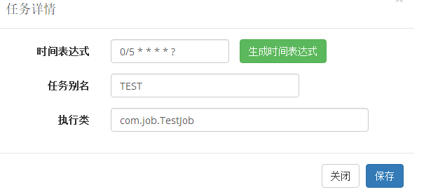

#spring-quartz 定时系统  
1. 执行 `base.sql` 文件
2. 根据自己使用的数据库来选择不同的quartz系统表（文件在`/doc/sql`目录下）  
3. 执行 sql目录下`tables_mysql_innodb.sql`（本示例选用的时Mysql数据库）    
4. 启动项目  
5. 添加一个定时任务（示例为TestJob）方法名为`com.job.TestJob`
6. 修改时间表达式时注意，需要在运行状态下才能修改成功
7. 新增操作 